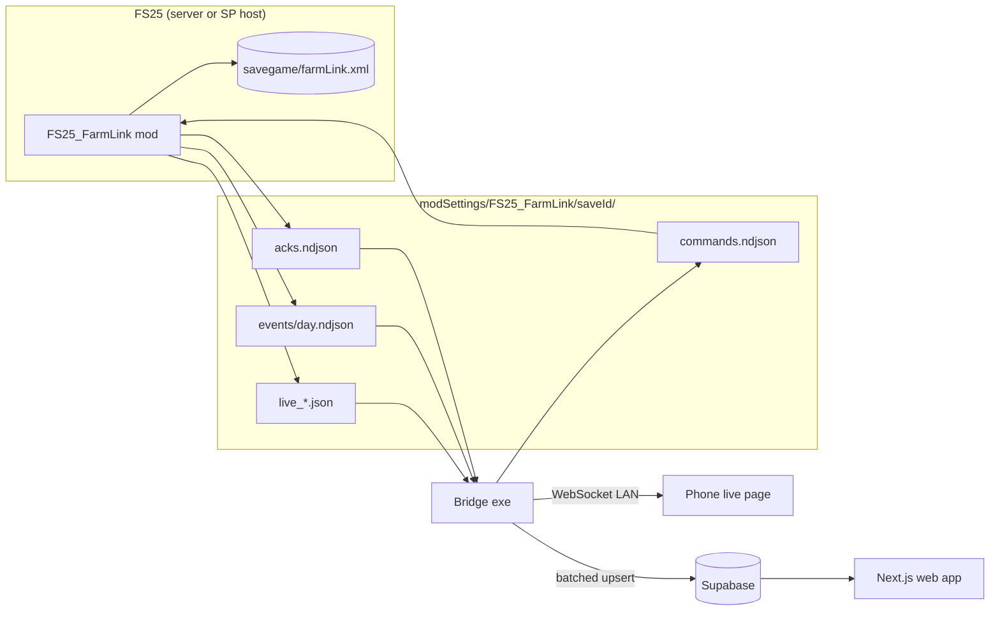

# FS25 FarmLink — Code Handoff

Sep 26, 2026 · @Derrick Hopson

## Overview

FarmLink turns every money, harvest, field-work and hired-worker event in an FS25 save into a durable ledger, then serves it three ways: in-game, on a phone, and in a web app. Positioning: the farm's accountant and dispatcher, multiplayer-first.

Live dashboards and single-player in-game ledgers already exist (VDTelemetry, FarmMonitor, Field Profitability Ledger, Transaction Log). The open gap is a multiplayer-safe event store with cross-season analytics, worker downtime tracking, and access away from the PC. Do not build another speedometer.

| Tier | What the player installs | What they get |
| --- | --- | --- |
| Mod only | FS25\_FarmLink (ModHub-eligible) | In-game analytics dialog, CSV export, aggregates saved in the savegame |
| Mod + Bridge | Mod + bridge executable (GitHub) | Live phone dashboard, worker stop alerts, remote worker commands, xlsx export |
| Mod + Bridge + Web | Plus a free account | Season analytics, history across saves, Discord reports, shared farm access |

**v1 scope:** event ledger, money funnel, harvest-to-field attribution, worker stop alerts, bridge sync, and three web views (field P&L, vehicle cost per hour, worker downtime). Everything else is P5 stretch.

## Locked decisions

These are settled. The implementer builds to them and flags only hard blockers. Rows marked *default* were recommended but not explicitly confirmed; edit the row to override.

| Area | Decision | Why |
| --- | --- | --- |
| Transport | Mod and bridge talk only through files in modSettings | FS25 Lua has no network bindings. Proven by VDTelemetry, FarmDashboard, InvestorFarm |
| Core product | The event log is the product; live state files are disposable | History and attribution are the differentiator. Live gauges are commodity |
| Money capture | Wrap `g_currentMission:addMoney` once, attach context from a short-lived context stack | One hook covers sales, fuel, wages, leasing, upkeep, and survives patches better than a dozen station hooks |
| Multiplayer | Server-authoritative from P0: only the server or SP host writes events and runs commands | Two prior analytics mods stayed single-player because this was retrofitted |
| Player attribution (*default*) | `userId` in every event envelope from P2 | Enables contribution tracking without a schema migration later |
| Canonical store | Ledger state (saveId, seq high-water, aggregates) lives in the savegame as `farmLink.xml` | Travels with the save and the dedicated server, rolls back correctly on reload |
| Command channel (*default*) | Built in P1: monotonic IDs, TTL, mod-side watermark, ack file | About a day of work early versus reworking the file protocol later |
| Bridge stack | Node + TypeScript, compiled to one executable with `bun build --compile` | Shares Zod schemas with the web app; no runtime install for players |
| Live data path | LAN only (bridge serves the phone page); Supabase stores history only | Low latency, works offline, stays inside free-tier limits |
| In-game UI | Hotkey dialog first, InGameMenu page later | GUI XML is the steepest learning curve; a dialog ships sooner |
| Distribution | GitHub first; ModHub build must be fully useful without the bridge; bridge never bundled in the mod | ModHub allows GitHub links from script mods; an external exe requirement is a rejection risk |
| AI driving | No pathing. Read-only integration with Courseplay, AutoDrive, Advanced Helper | Those mods own driving; rebuilding it is out of scope |
| Platform | PC/Mac only | Console mods cannot include scripts |

## Architecture

Three processes connected by files and one WebSocket. The mod never touches the network; the bridge owns all networking.



**File protocol.** Everything lives under `modSettings/FS25_FarmLink/<saveId>/`.

| File | Writer | Cadence | Contents |
| --- | --- | --- | --- |
| `meta.json` | Mod | On load, then every 60 s | Mod version, game version, saveId, branchId, schemaVersion, lastSeq, heartbeat timestamp |
| `live_vehicle.json` | Mod | 1 s | Active vehicle and attached implements |
| `live_fleet.json` | Mod | 5 s | Every farm vehicle and active AI worker |
| `live_farm.json` | Mod | 60 s | Balance, storage, productions, weather and forecast |
| `events/<gameDay>.ndjson` | Mod | Append on event | Event envelopes, one per line |
| `commands.ndjson` | Bridge | Append on user action | Commands with monotonic IDs |
| `acks.ndjson` | Mod | Append per command | Result per command ID |
| `export_request.json` | Mod | On in-game button | Asks the bridge to build an xlsx |
| bridge.json | Bridge | 5 s | Bridge version and heartbeat, so the mod can show bridge-only options |

**Runtime modes.**

| Mode | Mod logic runs on | Bridge runs on | Notes |
| --- | --- | --- | --- |
| Single-player | Local game | Same PC | Default dev target |
| Player-hosted MP | Host | Host PC | Clients run the mod for UI only and request data through network events |
| Self-hosted dedicated | Server | Server machine, watching the server profile's modSettings | Full feature set |
| Rented dedicated | Server | Not possible on most hosts | Savegame `farmLink.xml` only; FTP pull is P5 |

**saveId and branches.** On first load the mod generates a UUID saveId and stores it in `farmLink.xml`. Reloading an older save is detected when the savegame's seq high-water is lower than `meta.json` lastSeq; the mod then starts a new branchId (see Supabase schema).

## Repo layout

One pnpm monorepo. `packages/schema` is the single source of truth for every file format; the Lua side is tested against its exported JSON Schema.

```text
farmlink/
  mod/FS25_FarmLink/
    modDesc.xml
    l10n/l10n_en.xml, l10n_de.xml
    gui/FarmLinkDialog.xml
    scripts/
      FarmLink.lua            -- bootstrap, module registry, pcall isolation, server check
      core/Json.lua           -- encoder only, no deps
      core/FileIO.lua         -- path resolution, write, append, read, temp+rename if supported
      core/Clock.lua          -- game time, per-channel throttles
      core/EventLog.lua       -- envelope, seq, branch, day files
      core/Context.lua        -- short-lived context stack for money attribution
      core/Persistence.lua    -- farmLink.xml load/save
      collectors/Vehicle.lua, Fleet.lua, Farm.lua
      hooks/Money.lua, Harvest.lua, FieldWork.lua, AIWorkers.lua, FleetDiff.lua, Prices.lua
      commands/CommandChannel.lua, handlers/WorkerStop.lua
      aggregates/Aggregates.lua
      ui/FarmLinkDialog.lua
      export/CsvExport.lua
      net/FarmLinkCommandEvent.lua, FarmLinkSyncEvent.lua
  bridge/
    src/config.ts             -- modSettings auto-detect, pairing token, Supabase auth
    src/watch/                -- live readers, event tailer, ack tailer
    src/live/ws.ts            -- WebSocket server + alert rules
    src/sync/supabase.ts      -- batching, retry, disk queue
    src/commands/writer.ts
    src/export/xlsx.ts
    src/http/                 -- serves the built live page
  web/                        -- Next.js App Router, Tailwind, Supabase auth
  packages/schema/            -- Zod: envelope, events, live channels, commands, acks; JSON Schema export
  packages/live-ui/           -- React components shared by the bridge-served page and web
  supabase/migrations/
  docs/HANDOFF.md             -- this doc, exported
```

Tooling: pnpm workspaces, TypeScript strict, Vitest for bridge and schema, Biome or ESLint + Prettier. Lua has no test runner in-game; keep pure logic (Json, EventLog, Aggregates) runnable under standalone Lua 5.1 with busted, and stub engine calls.

## Mod (Lua) spec

Every hook and collector runs only where `g_currentMission:getIsServer()` is true. Client instances render UI and send network events, nothing else. Function names marked **(verify)** come from FS22 or third-party mods and must be confirmed in FS25 `gameSource.zip` before use.

**Bootstrap and isolation**

- Register with `addModEventListener`; implement `loadMap`, `deleteMap`, `update(dt)`.
- Each module exposes `init`, `update(dt)`, `onSave(xml)`, `onLoad(xml)`. The registry wraps every call in `pcall`.
- Three consecutive errors disable that module for the session and log once. The save must never break because FarmLink failed.
- Log a version fingerprint (mod version, game version, active integrations) at load and in `meta.json`.

**FileIO**

- Resolve the base dir: `g_currentModSettingsDirectory` **(verify)**, else `getUserProfileAppPath() .. "modSettings/FS25_FarmLink/"`. Create folders on first run.
- Use the engine file API (`createFile` / `fileWrite` / `delete`, or `XMLFile`) **(verify)**. Do not assume stock `io`.
- Live files: write to `*.tmp` then rename if the API supports it; otherwise write in place and let the bridge retry torn reads.

**Collectors (live channels)**

- `Vehicle` at 1 s: speed, RPM, gear, fuel %, damage %, operating hours, position, attached implements with fill type, level and capacity.
- `Fleet` at 5 s: every farm vehicle with id, name, position, fuel %, damage %, and controller (`player`, `ai`, `courseplay`, `autodrive`, `idle`); active AI jobs with type, field, progress estimate, tank fill.
- `Farm` at 60 s: balance via `Farm:getBalance()`, storage by fill type, production point stocks, current weather and the multi-day forecast.

**Money funnel**

- Overwrite `g_currentMission.addMoney(amount, farmId, moneyType, addChange, showChange)` with `Utils.overwrittenFunction`, call the original first, then emit a `money` event.
- Map `moneyType` to its name by iterating the `MoneyType` table at load.
- Before emitting, pop the newest matching entry from the context stack (TTL 1 s real time). Context producers: selling-station hook (stationId, fillType, liters), fuel purchase in `Motorized` (vehicleId, liters), AI wage tick (jobId, vehicleId), shop buy/sell (storeItem, vehicleId).

**Harvest attribution**

- Hook the combine's threshed-area / fill-gain path in the `Combine` specialization **(verify exact function)**.
- Resolve fieldId from the work area's world position through the field and farmland managers **(verify names)**. Unresolved positions keep `fieldId = null` plus `farmlandId`.
- Accumulate liters per (vehicle, fieldId, fillType) and flush one `harvest` event every 30 game-seconds, on field change, or on stop. Never emit per frame.

**Field work**

- Same accumulate-and-flush pattern for seeding, spraying, fertilizing and tillage via each specialization's work-area processing **(verify)**. Emit area in hectares and input consumed where the spec exposes it.

**Fleet diff**

- Keep an owned-vehicle set. On `MessageType.VEHICLE_REMOVED` (which carries no arguments), diff the set to find what left and pair it with the next `SHOP_VEHICLE_SELL` money event. Emit `vehicle_added` / `vehicle_removed`.

**AI workers**

- Listen for job start and finish (`onAIJobStarted`, `onAIJobFinished(job)`) and hook the AI system's stop path **(verify)** to capture the stop message.
- Map the message class to its registered name through the AI message manager (e.g. `ERROR_OUT_OF_FUEL`, `ERROR_UNLOADING_STATION_FULL`, `SUCCESS_FINISHED_JOB`, `SUCCESS_STOPPED_BY_USER`).
- Keep a worker registry (jobId, vehicle, field, start time, wages so far) in memory and in `farmLink.xml`, so resume after stop has the original job parameters.

**Prices**

- On each in-game day rollover, record the price per selling station per fill type. This is the only source for price curves, so it ships in P2 even though its views come later.

**Persistence (`farmLink.xml` in the savegame folder)**

- Stores saveId, branchId, seq high-water, command watermark, aggregates, worker registry, pending accumulator totals.
- Hook the career save path **(verify)** to write it, and read it in `loadMap`.

**Multiplayer network events**

- `FarmLinkCommandEvent`: client to server, carries an in-game command (export, worker stop from the dialog).
- `FarmLinkSyncEvent`: server to one client, carries that client's farm aggregates for the dialog, on request only.
- Remote AI starts (P5) go through `AIJobStartRequestEvent` **(verify in FS25)**, never a direct start on a client.

## Data contracts

All formats are versioned (`v`) and defined once in `packages/schema`. Money is one event type with a typed context; sales, fuel and wages are derived from it, so no amount is ever recorded twice.

**Event envelope** (one line in `events/<gameDay>.ndjson`)

```json
{
  "v": 1,
  "saveId": "6f1c...",
  "branchId": "a02e...",
  "seq": 1042,
  "day": 37,
  "minute": 845,
  "realTs": "2026-09-26T15:04:05Z",
  "farmId": 1,
  "userId": "steam:7656...",
  "type": "harvest",
  "data": { "fieldId": 12, "farmlandId": 12, "fillType": "WHEAT", "liters": 18450, "vehicleId": "v14", "isAI": true }
}
```

`userId` is null for AI-only or system events. `(saveId, branchId, seq)` is the natural key.

**Event types (v1)**

| Type | `data` fields | Source |
| --- | --- | --- |
| `money` | amount, moneyType, context: `{kind: sale\|fuel\|wage\|shop\|none, ...}` | Money funnel |
| `harvest` | fieldId, farmlandId, fillType, liters, vehicleId, isAI | Combine hook, flushed |
| `field_work` | fieldId, workType, areaHa, inputFillType, inputLiters, vehicleId, isAI | Work-area hooks, flushed |
| `vehicle_added` | vehicleId, storeItem, name, price, leased | Shop / fleet diff |
| `vehicle_removed` | vehicleId, reason: `sold\|deleted`, operatingHours | Fleet diff |
| `vehicle_hours` | vehicleId, operatingHours | Daily rollover |
| `worker_start` | jobId, vehicleId, jobType, fieldId | AI start listener |
| `worker_stop` | jobId, reason, durationMin, wagesTotal | AI stop hook |
| `price` | stationId, fillType, pricePer1000L | Daily rollover |
| `day_rollover` | balance, loan, financeByCategory | Daily rollover |
| `session` | modVersion, gameVersion, integrations\[\] | Load |

**Live channels** carry `v`, `saveId`, `realTs`, `day`, `minute`, then the collector payload defined in the Mod spec. No seq; they are overwritten.

**Commands** (one line in `commands.ndjson`, written by the bridge)

```json
{ "v": 1, "id": 57, "issuedAt": "2026-09-26T15:04:05Z", "ttlSec": 30, "farmId": 1, "type": "worker.stop", "args": { "jobId": "j9" } }
```

**Acks** (one line in `acks.ndjson`, written by the mod)

```json
{ "v": 1, "id": 57, "status": "ok", "message": null, "at": "2026-09-26T15:04:06Z" }
```

Rules: the mod processes IDs above its persisted watermark in order, rejects commands past TTL with `expired`, and advances the watermark even on failure. Every handler is idempotent (stopping a stopped worker returns `ok`). Status values: `ok`, `rejected`, `expired`, `error`.

| Command | Phase | Args |
| --- | --- | --- |
| `ping` | P1 | none |
| `worker.stop` | P1 | jobId |
| `worker.resume` | P5 | jobId (re-issues cached job parameters) |
| `worker.start` | P5 | vehicleId, jobType, fieldId, options |
| `queue.set` | P5 | vehicleId, ordered list of jobs |

## Bridge spec

The bridge is a single executable on the gaming PC or dedicated server. It reads the mod's files, serves the phone, syncs history, and writes commands. It must run for days unattended and never lose an event.

**Startup and config**

- Auto-detect `Documents/My Games/FarmingSimulator2025/modSettings/FS25_FarmLink/` on Windows and the equivalent macOS path; allow an override flag for dedicated servers.
- On first run, generate a pairing token and print it with a QR code of `http://<lan-ip>:8790/?t=<token>`. The WebSocket rejects connections without it.
- Supabase sign-in by magic link once; store the refresh token in the OS user config dir. Sync is optional: the bridge works LAN-only without an account.

**Readers**

- `live_*.json`: watch with chokidar; parse; on parse failure retry after 50 ms, up to 3 times; validate with Zod; drop invalid frames with a counted warning.
- `events/*.ndjson`: tail by byte offset per file, offsets persisted in `bridge-state.json`. Only complete lines (ending in newline) are consumed.
- `acks.ndjson`: tailed the same way; resolves pending command promises.
- `meta.json`: heartbeat. No update for 15 s marks the game offline on the live page.

**Live server**

- HTTP on port 8790 serves the built live page; WebSocket on the same port pushes channel updates as JSON diffs.
- Alert rules run on the incoming stream and push to connected clients: `worker_stop` (any reason except user-stopped), fuel under 10 % on an AI vehicle, tank ETA under 2 min, game offline.
- Web Push for background phone alerts ships in P2; Discord webhook in P5.

**Supabase sync**

- Batch up to 200 events or every 5 s, upsert on `(save_id, branch_id, seq)` with `ignoreDuplicates`.
- Failures back off exponentially (1 s to 5 min) and keep the batch in an on-disk queue. Offsets advance only after a confirmed write.
- Delete a day file only when it is fully synced and older than the current game day.
- Upsert one snapshot per game hour from `live_farm.json`.
- Gap check: if seq jumps, log it and raise a sync warning on the live page.

**Commands**

- The live page posts a command; the bridge assigns the next ID (persisted), appends to `commands.ndjson`, and waits for the matching ack or TTL.
- Returns the ack status to the page. The UI never assumes success.

**Exports**

- xlsx built with exceljs: sheets Fields, Vehicles, Sales, Finance, Workers, Events (raw). Totals rows, frozen headers, number formats.
- Triggered from the live page or by the mod's `export_request.json`; written to `Documents/FarmLink Exports/`.

**Packaging**

- `bun build --compile` per OS; Windows first. Log to a rolling file. A `--doctor` flag prints detected paths, file freshness, and sync status for support.

## Supabase schema

The `events` table is append-only and idempotent; everything else is derived or upserted. Analytics are SQL views, so the web app stays a thin client.

| Table | Primary key | Key columns | Notes |
| --- | --- | --- | --- |
| `saves` | `id` (mod saveId) | owner\_id, name, map, mod\_version, created\_at | One row per career save |
| `save_branches` | `(save_id, branch_id)` | parent\_branch\_id, fork\_seq, created\_at, is\_active | A reload of an older save starts a new branch |
| `save_members` | `(save_id, user_id)` | role: `owner\|member\|viewer` | Shared MP farm access (P5) |
| `events` | `(save_id, branch_id, seq)` | type, farm\_id, user\_id, day, minute, real\_ts, data jsonb | Index `(save_id, type, day)` |
| `snapshots` | `(save_id, branch_id, day, hour)` | payload jsonb | Hourly farm state |
| `fields` | `(save_id, field_id)` | farmland\_id, area\_ha, last\_seen\_day | Upserted from snapshots |
| `vehicles` | `(save_id, vehicle_id)` | store\_item, name, price, bought\_day, sold\_day | Upserted from events |
| `prices` | `(save_id, day, station_id, fill_type)` | price\_per\_1000l | Materialized from `price` events |

**Views (v1)**

- `field_season_pnl`: per field, fill type and season. Revenue = harvested liters × that season's average realized sale price for the fill type (grain is pooled in silos, so direct sale tracing is not possible). Costs = input money events with a field context + machine cost (vehicle cost per hour × hours worked on the field) + wages for jobs on the field.
- `vehicle_cost_per_hour`: (purchase price − current sell value + repairs + fuel + wages) ÷ operating hours.
- `worker_downtime`: stops by reason, count, total idle minutes between stop and next start, wages paid for incomplete jobs.
- `sale_vs_price_curve` (P4): each sale's price against the season min and max for that fill type and station.

**Branch rule.** Views read the active branch plus its ancestors up to each fork\_seq, so a reloaded save never double-counts.

**RLS.** Enable on every table. `saves`: `owner_id = auth.uid()` or a `save_members` row. Child tables: `exists` against `saves` with the same condition. The bridge writes with the signed-in user's session, never the service role.

## Web app spec

Next.js App Router on Vercel, Tailwind, Supabase auth. Mobile-first, dark by default, clean tables and charts, no emoji. The web app only reads views; it never computes ledger math client-side.

| Route | Shows | Phase |
| --- | --- | --- |
| `/saves` | Saves the user owns or belongs to, last sync time, branch indicator | P4 |
| `/saves/[id]` | Season summary: net result, top and bottom fields, costliest vehicles, open alerts | P4 |
| `/saves/[id]/fields` and `/fields/[fieldId]` | Field P&L by season, yield history, operations timeline | P4 |
| `/saves/[id]/vehicles` | Cost per hour, hours, fuel, repairs; replace-or-keep flag (P5) | P4 |
| `/saves/[id]/workers` | Downtime by reason, idle time, wages, hired vs self-driven cost per hectare | P4 |
| `/saves/[id]/market` | Price curves per fill type and station, your sales plotted on them | P4 |
| `/saves/[id]/settings` | Members, Discord webhook, alert thresholds | P5 |
| `/live` | Same live components as the bridge page, via Supabase Realtime for off-LAN viewing | P5 |

**Exports.** Every table view has an Export button (SheetJS, client-side) that respects the current season and filters.

**Shared UI.** Gauges, fleet list, worker board and alert toasts live in `packages/live-ui` and are used by both the bridge-served page and `/live`.

## In-game page and exports

The in-game view is deliberately simple: four tables from savegame aggregates, readable in five seconds. Anything deeper links out to the web app.

**Dialog (P3).** Opened by a hotkey registered in `modDesc.xml`. Tabs:

| Tab | Columns |
| --- | --- |
| Fields | Field, crop, area (ha), revenue, costs, net, net per ha, this season vs last |
| Vehicles | Vehicle, hours, cost per hour, fuel, repairs, flag if over farm average by 50 % |
| Sales | Fill type, liters sold, your average price, season high, gap % |
| Farm | Net this season, last season, wages, top stop reason for workers |

**Aggregates.** Maintained incrementally by `Aggregates.lua` as events are emitted (never recomputed from files), saved in `farmLink.xml`. In MP the client asks the server with `FarmLinkSyncEvent` when the dialog opens and gets only its own farm's data.

**Later (P5).** Promote the dialog to an InGameMenu frame. ModHub requires EN and DE strings and support for 4:3, 16:9, 16:10 and 21:9 on any custom UI; build to that from the start.

**Exports.**

- CSV (mod only): the dialog's Export button writes `fields`, `vehicles`, `sales`, `finance` CSVs to `modSettings/FS25_FarmLink/exports/<saveName>_day<N>_*.csv`.
- Excel (bridge present): if `bridge.json shows a` heartbeat under 10 s old, the dialog also shows Export Excel, which writes `export_request.json`; the bridge builds the xlsx and drops a toast on the live page.

## Phases

Each phase ends on a testable exit criterion; do not start the next phase until it passes. P0 exists to kill the file-I/O and hook-name unknowns before any real code is written.

| Phase | Build | Exit criteria |
| --- | --- | --- |
| P0 Spike | Mod loads, resolves the modSettings path, writes `live_vehicle.json` at 1 s. Bridge prints it. Probe calls for verify-first items 1 to 6 | File updates cleanly in SP; frame-time cost under 0.5 ms per write; every verify-first item 1 to 6 answered in this doc |
| P1 Live | Vehicle, fleet and farm channels; bridge WebSocket with pairing token; phone page with gauges, fleet list, worker board; AI start/stop hooks; stop alerts; command channel with `worker.stop` | Phone tracks the active tractor with under 1.5 s latency; a worker stop alert arrives with the correct reason; stopping a worker from the phone works in SP and on a player-hosted MP game |
| P2 Ledger | Event log with seq, branches and savegame persistence; money funnel and context stack; harvest and field-work attribution; fleet diff; daily prices; Supabase sync; Web Push | One full in-game season in SP and on an MP host lands in Supabase with no seq gaps; per-day sum of `money` events equals the balance change within 1; a reloaded older save creates a new branch |
| P3 In-game | Aggregates, dialog with four tabs, CSV export, xlsx via bridge | Dialog numbers match the SQL views for the same save within rounding; CSV opens cleanly in Excel |
| P4 Web | Auth, saves list, field, vehicle, worker and market views, client-side exports | All four views populated from a real multi-season save; views load under 1 s for a save with 100k events |
| P5 Stretch | Worker resume and remote start, job queue, sell alerts, Discord reports, replace-or-keep, dedicated/rented server mode, InGameMenu page, OBS overlay, Precision Farming, ask-your-farm | Scoped individually when picked up |

The money reconciliation check in P2 is the single most important test in the project: if every day's `money` events sum to the balance change, the ledger is trustworthy and every downstream view inherits that.

## Verify first, then risks

These names and behaviors are inferred from FS22 or third-party mods. Confirm each in the FS25 SDK (`sdk/debugger/scriptBinding.xml` for engine bindings, `gameSource.zip` for game scripts) during P0 and record the real signature here. Items 1 to 6 block P0 exit.

| # | Unknown | How to confirm | Fallback |
| --- | --- | --- | --- |
| 1 | Engine file API for create, write, append, read, delete; whether `io` exists | `scriptBinding.xml`; read FileIO in VDTelemetry and FarmDashboard | Write via `XMLFile` only, with the bridge converting |
| 2 | `g_currentModSettingsDirectory` in FS25 | Print at load | `getUserProfileAppPath()` path |
| 3 | Atomic rename available | `scriptBinding.xml` | Bridge retries torn reads (already designed) |
| 4 | `addMoney` signature and `MoneyType` table layout | `gameSource.zip`; InvestorFarm source | None needed; this pattern is proven |
| 5 | Combine fill-gain function and field lookup from position | `Combine.lua`, field and farmland managers; YieldTracker source | Attribute by farmland ID only |
| 6 | AI stop path, message class to name mapping, `onAIJobStarted` / `onAIJobFinished` | `AISystem.lua`, `AIMessageManager.lua` | Poll active jobs each second and diff |
| 7 | Career save hook for a custom XML | `FSCareerMissionInfo` in `gameSource.zip`; Transaction Log source | Persist to modSettings keyed by saveId |
| 8 | `AIJobStartRequestEvent` and `AISystem` start/stop in FS25 (P5) | `gameSource.zip`; Courseplay\_FS25 source | Stop-only remote control |
| 9 | Lua dialect (reported move to Luau) for the offline test harness | Check a syntax feature at load | Keep pure modules to plain 5.1 syntax |
| 10 | Precision Farming statistic accessors (P5) | `FS25_precisionFarming` internal mod scripts | Skip PF data |
| 11 | Current FS25 ModHub guideline text | GIANTS forum FS25 guidelines thread | Stay GitHub-only |

**Risks**

- **Game patches break hooks.** Courseplay has broken across several FS25 patches. Mitigation: pcall isolation per module, version fingerprint in every session event, one hook file per feature so a fix touches one file.
- **MP desync.** Any state change on a client is a bug. Mitigation: server check at the top of every hook, commands routed through network events, test on a dedicated server from P1.
- **Harvest attribution drift.** Liters attributed to fields may not equal liters stored. Mitigation: daily cross-check of harvested liters against silo deltas, logged as a data-quality metric on the web.
- **Save forks.** Handled by branches; test it deliberately in P2 by reloading an older save.
- **GUI time sink.** Dialog first, tables only, no in-game charts.
- **Crowded niche.** Stay compatible with, and credit, Field Profitability Ledger, Precision Farming, Courseplay, AutoDrive and Advanced Helper rather than competing on their features.

## References

Read real code before writing hooks; the GDN pages are thin and some community examples are machine-generated.

| Source | Use it for |
| --- | --- |
| [GDN FS25 LUADOC](https://gdn.giants-software.com/documentation_scripting_fs25.php) | Official class reference (AI, Economy, Jobs, Specializations) |
| [GDN AIMessageManager](https://gdn.giants-software.com/documentation_scripting_fs25.php?version=script&category=28&class=248) | AI stop message names |
| [FS25 Community LUADOC](https://umbraprior.github.io/FS25-Community-LUADOC/) | Searchable community docs |
| [Dukefarming/FS25-lua-scripting](https://github.com/Dukefarming/FS25-lua-scripting) | dataS script dump to grep for hook names |
| [VertexDezign/VDTelemetry](https://github.com/VertexDezign/VDTelemetry) | File channels and command channel with watermark |
| [JoshWalki/FarmDashboard](https://github.com/JoshWalki/FarmDashboard) | 1 s JSON collector pattern |
| [Cypris2010/FS25\_FarmMonitor](https://github.com/Cypris2010/FS25_FarmMonitor) | Lua JSON export plus SSE dashboard |
| [iNotrez/FS25\_InvestorFarm](https://github.com/iNotrez/FS25_InvestorFarm) | `addMoney` funnel, MoneyType mapping, vehicle-removed diff |
| [rittermod/FS25\_TransactionLog](https://github.com/rittermod/FS25_TransactionLog) | Savegame persistence and CSV export |
| [BitBarn-Mods/FS25\_YieldTracker](https://github.com/BitBarn-Mods/FS25_YieldTracker) | Harvest-to-field attribution |
| [user01010111/FS25\_FieldProfitabilityLedger](https://github.com/user01010111/FS25_FieldProfitabilityLedger) | Closest analytics competitor; field accounting model |
| [Courseplay/Courseplay\_FS25](https://github.com/Courseplay/Courseplay_FS25) | Starting AI jobs through network events |
| [meisterjk/FS25\_AdvancedHelper](https://github.com/meisterjk/FS25_AdvancedHelper) | Worker integration point |
| [ModHub guidelines](https://farming-simulator.com/modhub-guidelines) | Submission rules (check the FS25 forum thread for the current version) |
